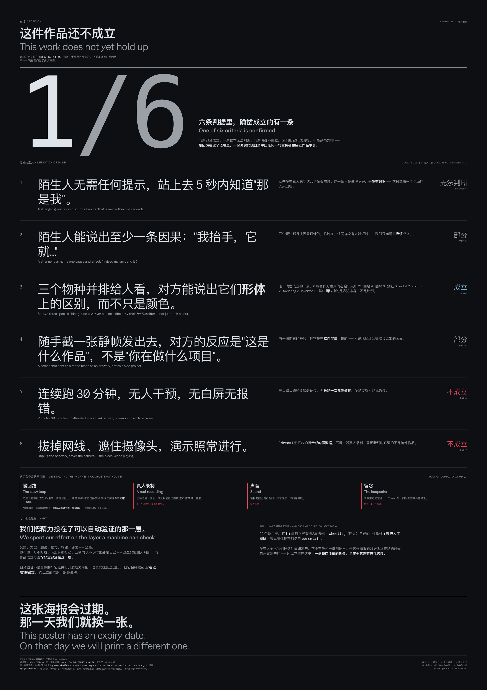

# SEE-ME SEE-U

> SEE-ME SEE-U — a body that only stands up while you are standing there.

Stand in front of the camera and pick a species. A life-size synthetic body
comes alive on your skeleton and copies you — and the more you move, the more
elaborate it grows. Meanwhile your silhouette is sent to a 3D generation model;
about a minute later, a part generated from *you* is growing on it. That second
loop exists only on the installation machine — the deployed build linked below
is the fast loop alone.

**Live:** [useeme.ptoq.io](https://useeme.ptoq.io) ·
[what it is](https://useeme.ptoq.io/about) ·
[how it was made](https://useeme.ptoq.io/making) ·
[take your body home](https://useeme.ptoq.io/passport)

`u-see.me` is the address the work is meant to end up on. It is bought and
registered against the project, but its nameservers still point at the
registrar's parking page — it does not serve the piece yet
([`docs/13-DEPLOY.md`](docs/13-DEPLOY.md) §7).



The artwork is titled **SEE-ME SEE-U**; the engineering codename stays
`second-body` — the repository, the packages, the `@smu/*` prefix. The split is
deliberate: what the audience reads is a wall label, not a repository name.

## Statement

> SEE ME. SEE U. NOT ME. BUT U. AND U SEE ME.

The artist's line, and the only English inside a statement otherwise written in
Chinese. The statement is set in full, in the original, on
[`/about`](https://useeme.ptoq.io/about); it names the five terms the piece
is built on — *datafication*, *Morphogenesis*, *zoe*, *simulacrum*, *distributed
agency*. Everything below this line is the engineering account of the same
object, written by the people who built it.

## State

A reverse-engineered reconstruction of Universal Everything's *Future You*
(Barbican, 2019), with the layer that did not exist in 2019 — real-time AI 3D
generation — put back inside the interaction loop.

Re-derived from `assets/parts/parts.json` by running
`node packages/app/poster/build-data.mjs` on 2026-09-13: **29 roster entries**,
25 of which currently carry parts; **208 normalised parts** across 10 slots;
**8 body plans** — seven skeleton remappings in
[`packages/core/src/bodyplan.ts`](packages/core/src/bodyplan.ts) (`rig`,
`quadruped`, `towering`, `stub`, `inverted`, `radial`, `column`) plus `mass`,
which replaces the rigid body entirely. At tier 2 that is a combinatorial
capacity of **1,446,403 distinct bodies** — vacant entries that have never
produced a part of their own are excluded from the count on purpose. Re-run that
command rather than trusting the numbers in this paragraph.

**What actually runs is decided by [`docs/10-SURFACES.md`](docs/10-SURFACES.md),
not by this file.** The slow loop, the stage and the main chain are still marked
`experimental` there, and the main chain has only ever been driven by recorded
pose data — never by a real person.

## What it is not

- **Not a skinned character.** Bodies are chains of rigid parts. A deforming
  mesh would read as a game character; the point is that the material is visibly
  assembled. See [`docs/18-BODY-PLANS.md`](docs/18-BODY-PLANS.md).
- **Not real-time 3D generation.** Generation is a slow loop of roughly a
  minute, deliberately kept out of the frame loop. If it fails, the fast loop
  does not notice.
- **Not a framework.** Nothing here is built to be reused. It is built to survive
  one evening with an audience in front of it.
- **Not a product.** The code is MIT; the artwork is not.

## Run

Node ≥ 22 — the source is `.ts` run directly through Node's type stripping, so
there is no build step to develop against.

```bash
npm install
npm run doctor          # environment self-check
npm run dev             # → http://localhost:5173
npm run kiosk           # build + serve + open /?kiosk=1 — the installation itself
```

It runs with no assets at all (placeholder geometry). The one gate before
merging anything is:

```bash
npm run check           # typecheck + tests + part-contract check
```

## Read

Three files, in this order, and you can start changing things:

1. [`AGENTS.md`](AGENTS.md) — the reading route, the invariants, and the
   baseline self-check you run **before** you start;
2. [`docs/02-ENGINEERING-PRINCIPLES.md`](docs/02-ENGINEERING-PRINCIPLES.md) —
   the constitution, P0–P20, each principle carrying the incident that taught it;
3. [`docs/10-SURFACES.md`](docs/10-SURFACES.md) — the only trustworthy statement
   of what works, with an evidence column.

Then [`docs/index.md`](docs/index.md) routes you to the rest by need. Do not read
`docs/` end to end. If you are setting the piece up in a room rather than
changing it, the one you want is
[`docs/38-RUNNING-THE-PIECE.md`](docs/38-RUNNING-THE-PIECE.md) — hardware, the
URL flags, permission, and what to do when it goes wrong.

**Every tunable number in the project lives in one file**,
[`packages/core/src/tuning.ts`](packages/core/src/tuning.ts) — capture, filtering,
rig, motion, evolution, morphology, render budget, slow loop. If you find
yourself tuning a constant anywhere else, it is in the wrong place.

**Three things are frozen contracts:**
[`packages/core/src/types.ts`](packages/core/src/types.ts),
[`docs/03-SPEC-part-library.md`](docs/03-SPEC-part-library.md) and
[`docs/04-SPEC-rig-and-attach.md`](docs/04-SPEC-rig-and-attach.md). You do not
edit them, even when your change appears to require it. Stop and report
`contract change needed: <reason>`; the contract owner makes the edit and
broadcasts it. The reasoning is P0 and P11.

## Structure

```
packages/core      pure logic (filtering, rig, attachment, evolution, genome) — zero deps, runs under node --test
packages/app       browser runtime (vite + three.js WebGPU + MediaPipe)
packages/factory   node (Hyper3D client, asset pipeline, slow-loop proxy)
assets/parts       normalised parts + parts.json    ← the only interface between runtime and factory
assets/raw         raw Rodin output + ledger.json   (gitignored)
```

The asset factory needs a Hyper3D key and spends credits; its commands and
budget gates are documented in [`docs/index.md`](docs/index.md), not here.

## Licence

The **source code** is MIT — see [`LICENSE`](LICENSE). Four things are carved
out of it: the ring ported from Viscose-carousel, the ZKMSerendipity typeface, the
generated `.glb` parts and anchor images, and the artwork itself. The carve-outs
are written out in `LICENSE` and restated for the audience under *Credits and
licence* on [`/about`](https://useeme.ptoq.io/about). Open source code does
not mean the piece may be re-exhibited.
